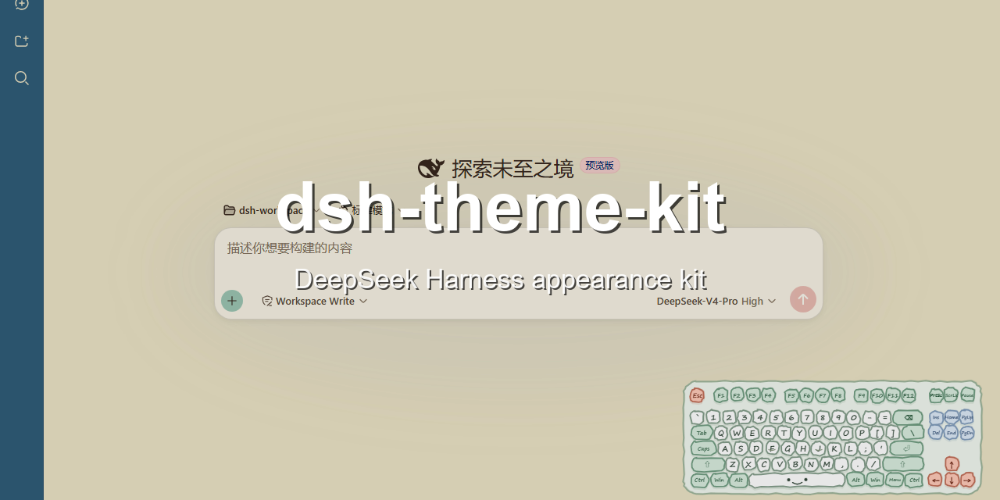
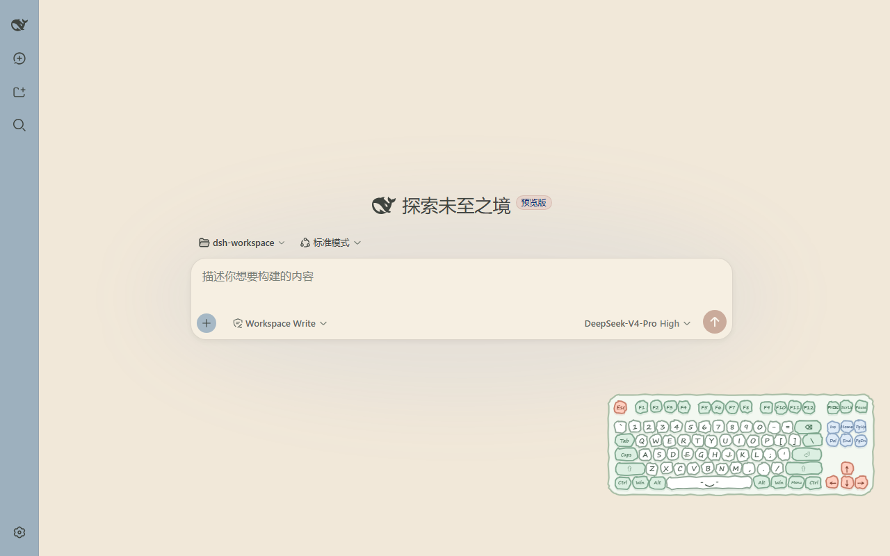
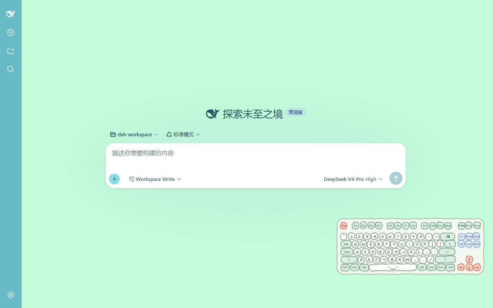
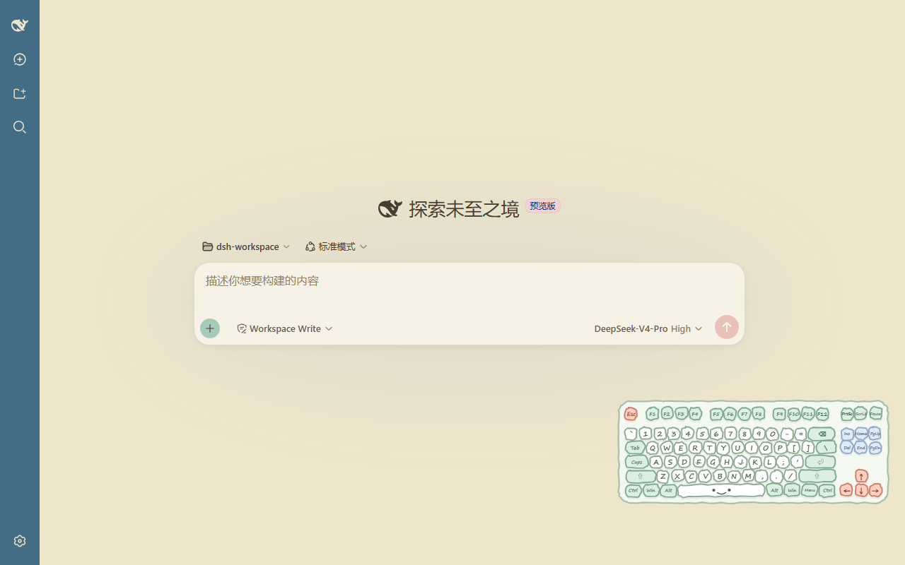
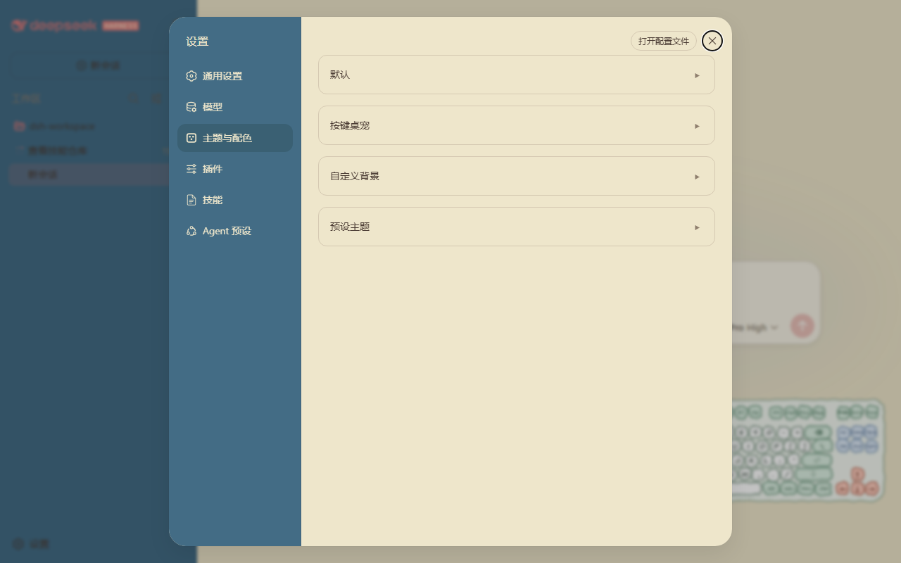

# dsh-theme-kit

English | [中文](README.md)

<p align="center">
  
</p>

<p align="center">
  <a href="https://github.com/ink5897/dsh-theme-kit"></a>
  <a href="https://github.com/ink5897/dsh-theme-kit/releases"></a>
  <a href="LICENSE"></a>
</p>

> A DeepSeek Harness Web GUI appearance kit: 32 preset themes, animated and static wallpapers, paper textures, per-zone opacity and text depth, plus a keyboard desktop pet.

## Highlights

- **32 themes** across Morandi / Macaron / Chinese traditional palettes, one-click switch
- **Animated wallpapers**: built-in video wallpapers that play smoothly
- **Paper textures**: 7 patterns with adjustable strength and color
- **Per-zone fine-tuning**: opacity and text depth for main / sidebar / cards / input / settings
- **Keyboard pet**: a desktop pet that follows your key presses; draggable and resizable

## Showcase

### Themes (one per palette)

| Morandi | Macaron | Chinese traditional |
|---|---|---|
|  |  |  |

### Settings

| Preset theme settings | Custom background settings |
|---|---|
|  |  |

## Quick start

```bash
git clone https://github.com/ink5897/dsh-theme-kit.git
cd dsh-theme-kit
dsh plugin --profile web add link:.
```

Restart `dsh web`, then open Settings and the "Themes & Colors" section.

## Preset themes

32 presets across 3 palettes:

| Palette | Count | Presets |
|---|---|---|
| Morandi | 12 | Oat Mocha, Soy Mochi, Olive Candy, Moss Milk, Perilla Mochi, Berry Breeze, Orange Milk Cap, Seaweed Jelly, Peach Hazelnut, Osmanthus Oolong, Mint Coffee, Algae Choco |
| Macaron | 8 | Sea Salt Frappe, Sakura Shake, Peach Candy, Berry Frost, Lemon Sea Breeze, Purple Yam Custard, Matcha Apricot, Grape Jelly |
| Chinese traditional | 12 | Azurite Ochre, Lotus Crimson, Snow Peach, Bamboo Azure, Tang Tricolor, Vermilion Wall, Rouge Teal, Frontier Sunset, Walnut Amber, Wisteria Apricot, Osmanthus Bamboo, Lantian Jade |

## Wallpapers

| Type | Count | Wallpapers |
|---|---|---|
| Animated (video) | 3 | 五条悟 (Gojo Satoru), 柯基小狗 (Corgi), 线条小狗 (Line puppy) |
| Static (image) | 3 | 夏日海边 (Seaside), 树荫 (Tree shade), 线条小狗 (Line puppy) |

## Textures

7 paper textures: 纸纹 1, 祥云纹 (cloud), 回纹 (fret), 涟漪纹 (ripple), 波浪纹 (wave), 螺旋纹 (spiral), 菱格纹 (diamond).

## Customization

| Category | What you can adjust |
|---|---|
| Theme | 32 presets, or system / light / dark |
| Background | import + crop, or 6 built-in wallpapers |
| Glass | blur, saturation, brightness |
| Texture | 7 patterns + strength + color |
| Position / size | center / top / bottom; cover / contain / actual |
| Surface opacity | main / sidebar / cards / input / settings |
| Text depth | main / sidebar / cards / input / settings |
| Keyboard pet | on / off, drag, resize, reset position |

## Install

Prerequisites: DeepSeek Harness (`dsh`), Node.js 18+, pnpm on PATH.

```bash
git clone https://github.com/ink5897/dsh-theme-kit.git
cd dsh-theme-kit
dsh plugin --profile web add link:.
```

## Development

The plugin is a single DSH bundle package with no build step; DSH loads the source directly:

- `lib/index.js` — host half: the `themeKit` remote service (persistence) + the `/dsh-theme-kit-wallpapers` route
- `lib/client.js` — browser half: background / theme / text depth / keyboard pet
- `wallpapers/` — bundled wallpapers and textures
- `cordis.patch.yml` — the bundle patch that mounts the plugin

## Known limitations

- Per-zone opacity and text depth are applied through CSS custom-property overrides scoped to the shell DOM; the shell's internal class names may change across versions.
- The keyboard pet and brand-color rules depend on the shell's DOM structure.

## License

[MIT](LICENSE)
