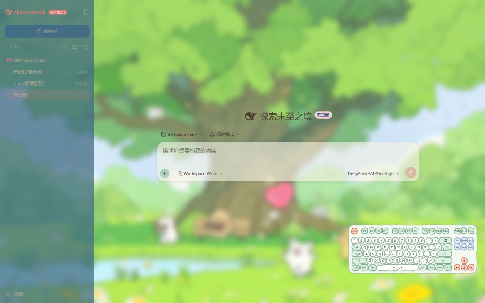
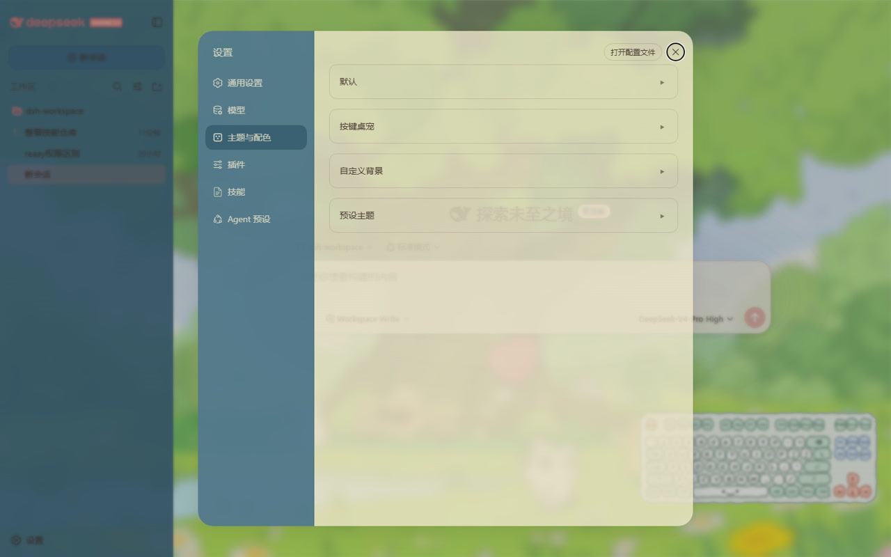

# dsh-ui-kit

[English](README.md) | 中文

DeepSeek Harness Web GUI 外观插件：预设配色主题、自定义背景（壁纸 / 玻璃 / 纹理）、分区文字深浅、按键桌宠。

## 截图





## 功能

- **预设主题**：按色系分组（莫兰迪 / 马卡龙 / 中国传统色），一键切换。
- **自定义背景**：导入并裁剪图片，或选用内置壁纸（静态 / 视频）。
- **玻璃效果**：背景图的模糊 / 饱和度 / 亮度。
- **纸纹纹理**：内置纹样，可调强度与颜色。
- **分区透明度**：微调主区 / 侧边栏 / 卡片 / 输入区 / 设置面板的表面透明度。
- **分区文字深浅**：调节主区 / 侧边栏 / 卡片 / 输入区 / 设置面板的文字颜色深浅。
- **按键桌宠**：跟随按键的桌面宠物，可拖动、缩放。

## 安装

前置条件：已安装 DeepSeek Harness（`dsh`），Node.js 18+，且 `pnpm` 在 PATH 中。

```bash
git clone https://github.com/ink5897/dsh-ui-kit.git
cd dsh-ui-kit
dsh plugin --profile web add link:.
```

重启 `dsh web`，在设置面板中即可看到「主题与配色」分区。

## 配置

所有选项均在设置面板中暴露，并自动持久化：

- 预设主题：选择主题，或跟随系统 / 浅色 / 深色。
- 自定义背景：导入 / 裁剪 / 壁纸 / 玻璃 / 纹理 / 位置 / 缩放。
- 分区透明度与文字深浅。
- 按键桌宠：开关 / 重置位置。

## 开发

插件是单个 DSH bundle 包，无需构建步骤，DSH 直接加载源码。

- `lib/index.js` — 宿主半区：`uiKit` 远程服务负责持久化，`/dsh-ui-kit-wallpapers` 路由流式提供内置壁纸。
- `lib/client.js` — 浏览器半区：背景、主题、文字深浅、按键桌宠。
- `wallpapers/` — 内置静态 / 视频壁纸与纹理。
- `cordis.patch.yml` — 挂载插件的 bundle patch。

## 已知限制

- 分区透明度与文字深浅通过作用在界面 DOM 上的 CSS 自定义属性覆盖实现，界面内部类名可能随版本变化。
- 按键桌宠与标志配色规则依赖界面的 DOM 结构。

## 许可证

MIT
