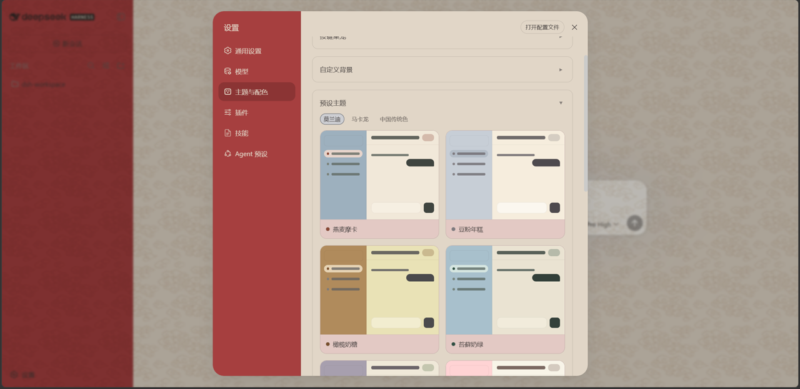
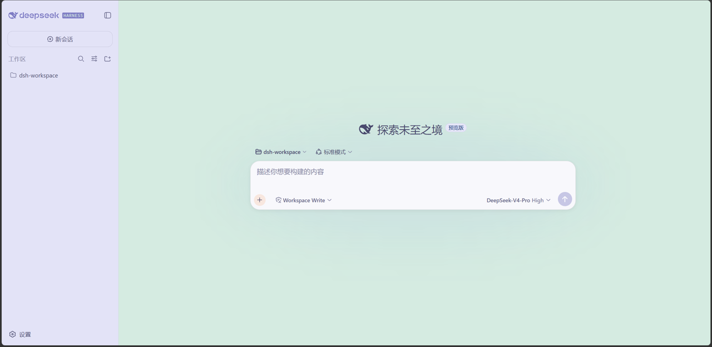
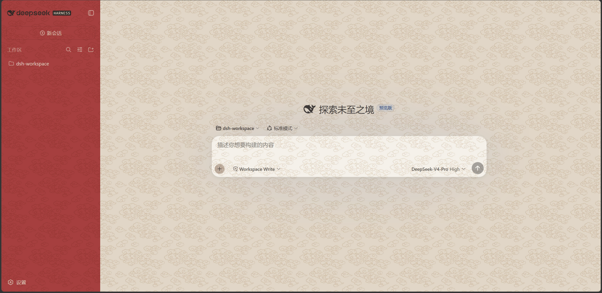
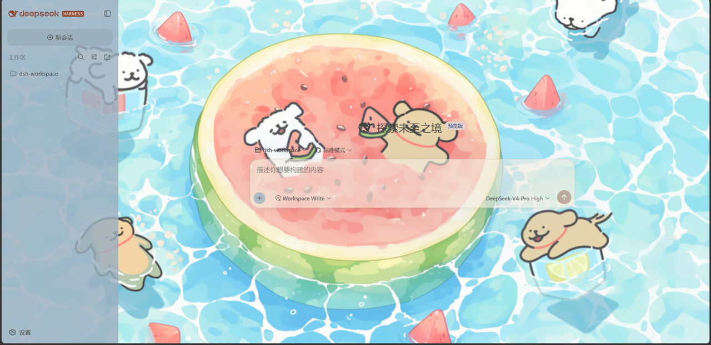

# dsh-theme-kit

[English](README.md) | 中文

DeepSeek Harness Web GUI 外观套件：三个色系共 32 款预设主题、自定义背景（导入图片或选用内置动态 / 静态壁纸，配玻璃与纸纹）、分区表面透明度与文字深浅、按键桌宠。

## 截图









## 功能

- 三个色系共 32 款预设主题，一键切换
- 自定义背景：导入并裁剪图片，或选用 6 张内置壁纸（3 动态 + 3 静态）
- 玻璃效果（模糊 / 饱和度 / 亮度）与 7 种纸纹纹理
- 分区表面透明度与文字深浅（主区 / 侧边栏 / 卡片 / 输入区 / 设置面板）
- 跟随按键的桌面宠物

## 预设主题

三个色系共 32 款：

| 色系 | 数量 | 预设 |
|---|---|---|
| 莫兰迪 | 12 | 燕麦摩卡、豆粉年糕、橄榄奶糖、苔藓奶绿、紫苏麻薯、莓语轻风、橙香奶盖、海苔奶冻、甜桃榛果、桂花乌龙、薄荷奶咖、蓝藻奶巧 |
| 马卡龙 | 8 | 海盐冰沙、樱花奶昔、蜜桃奶糖、莓果奶霜、柠檬海风、紫薯奶黄、抹茶杏子、葡萄奶冻 |
| 中国传统色 | 12 | 石青赭脂、藕荷绛色、雪青桃夭、苍筤霁青、长安三彩、朱墙驼铃、胭脂青黛、落日胡天、胡桃琥珀、紫藤青杏、金桂竹影、蓝田碧玉 |

## 壁纸

| 类型 | 数量 | 壁纸 |
|---|---|---|
| 动态壁纸（视频） | 3 | 五条悟、柯基小狗、线条小狗 |
| 静态壁纸（图片） | 3 | 夏日海边、树荫、线条小狗 |

## 纹理

7 种纸纹：纸纹 1、祥云纹、回纹、涟漪纹、波浪纹、螺旋纹、菱格纹。

## 自定义内容

| 类别 | 可调整项 |
|---|---|
| 主题 | 32 款预设，或跟随系统 / 浅色 / 深色 |
| 背景 | 导入 + 裁剪，或 6 张内置壁纸 |
| 玻璃 | 模糊、饱和度、亮度 |
| 纹理 | 7 种纹样、强度、颜色 |
| 位置 / 缩放 | 居中 / 顶部 / 底部；铺满 / 适应 / 原尺寸 |
| 表面透明度 | 5 个分区（主区 / 侧边栏 / 卡片 / 输入区 / 设置面板） |
| 文字深浅 | 5 个分区（主区 / 侧边栏 / 卡片 / 输入区 / 设置面板） |
| 按键桌宠 | 开关、拖动、缩放、重置位置 |

## 安装

前置条件：已安装 DeepSeek Harness（`dsh`），Node.js 18+，且 `pnpm` 在 PATH 中。

```bash
git clone https://github.com/ink5897/dsh-theme-kit.git
cd dsh-theme-kit
dsh plugin --profile web add link:.
```

重启 `dsh web`，在设置面板中即可看到「主题与配色」分区。

## 开发

插件是单个 DSH bundle 包，无需构建步骤，DSH 直接加载源码。

- `lib/index.js` — 宿主半区：`themeKit` 远程服务负责持久化，`/dsh-theme-kit-wallpapers` 路由流式提供内置壁纸。
- `lib/client.js` — 浏览器半区：背景、主题、文字深浅、按键桌宠。
- `wallpapers/` — 内置动态 / 静态壁纸与纹理。
- `cordis.patch.yml` — 挂载插件的 bundle patch。

## 已知限制

- 分区透明度与文字深浅通过作用在界面 DOM 上的 CSS 自定义属性覆盖实现，界面内部类名可能随版本变化。
- 按键桌宠与标志配色规则依赖界面的 DOM 结构。

## 许可证

MIT
